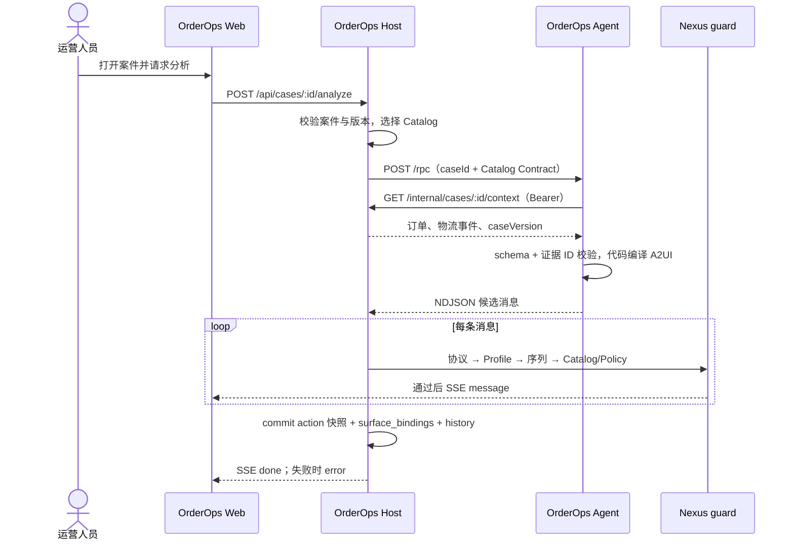
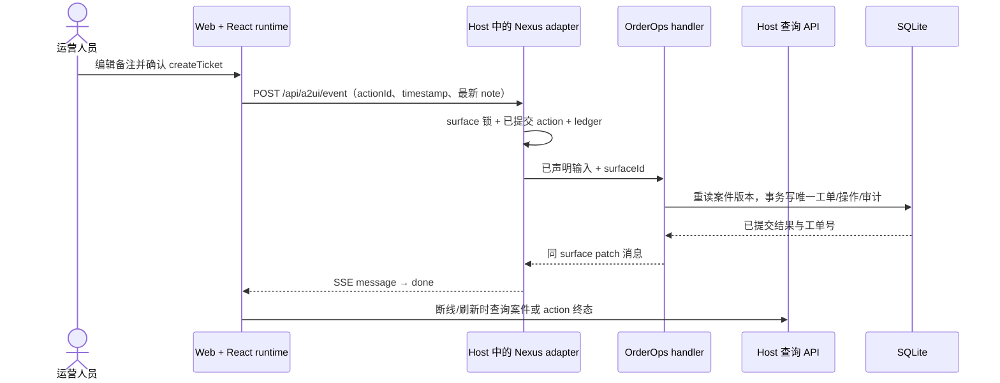

# ARCHITECTURE — SDK 与验证工程拓扑

状态：SDK 是主体，OrderOps 是验证工程；标明 M2/M3 尚未接通的目标路径。上游需求见 [PRD](PRD.md)，边界契约见 [SPEC](SPEC.md)，设计理由见 [DESIGN](DESIGN.md)。

## 1. SDK 框架设计与验证拓扑

SDK 面向 Web 宿主：core 独立于框架和传输，React 将 VNode 映射到宿主组件，有限 server 入口装配 guard/Agent/action。当前浏览器 transport 由示例实现；是否抽成 client/组合层取决于独立宿主的接入重复点。包边界、兼容和产物在独立宿主验收；下图的 OrderOps 只是其中一个消费方。

```text
Agent candidate NDJSON ──▶ Host server guard ──▶ transport/SSE ──▶ core runtime
                              │                                       │
                              │                                VNode + dataModel
                              │                                       ▼
Host Catalog + Policy ────────┘                          React / host renderMap
                              ▲                                       │
                              │                                 user input/action
                              └──────── Host handler ◀── action transport ──┘
                                           │
                                  domain transaction + patch
```

### 1.1 包内模块与依赖方向

| 层 / 代码位置 | 负责的状态与接口 | 依赖约束 |
| --- | --- | --- |
| `packages/nexus-core/src/{buffer,protocol,catalog}` | JSONL 分帧、v0.9 信封/Profile、Catalog schema/policy、prompt contract | 不感知 HTTP、Koa、DOM、React 或业务对象 |
| `packages/nexus-core/src/{state,runtime,render,dataModel,action,checks}` | surface 生命周期、VNode、绑定解析、action 事件和有限 checks | 可替换渲染器，运行时不执行领域 action |
| `packages/nexus-react/src/{provider,renderer,components}` | Provider、标准 renderMap、宿主组件映射、输入与无障碍状态 | 依赖 core 公开入口；不拥有业务事实或 transport |
| `server/nexus-playground-server/src/agent` | AgentAdapter、Catalog Contract、guard、Policy、历史、run 与 action 快照 | 以有限 `@nexus-ui/server` 根入口提供装配，不反向 import OrderOps |
| `server/nexus-playground-server/src/api` | guarded router、外部 RPC、SSE 与事件入口 | 参考 HTTP 装配；自定义宿主可组合公开 API |
| 浏览器接入逻辑（示例中） | 解析 SSE、区分终态、构造 action 信封并挂载 surface | 目前不是 SDK 公共 API；抽取前先核对两个消费方的重复逻辑 |

服务端 guard 是 Agent 输出进浏览器前的主准入点；core 在浏览器再次校验并持有显示状态。`createCatalogPromptContract` 只帮助 Agent 生成，不能替代 guard。四层职责是 Protocol 识别结构、Profile 裁剪特性、Catalog 限定组件/字段/action、Policy 应用宿主工作流。React 只负责展示，不替 Host 认定业务事实。

```text
Browser / OrderOps Web (:3200)
  ├─ @nexus-ui/react → @nexus-ui/core
  └─ HTTP + SSE ↔ OrderOps Host (:3201)
                    ├─ @nexus-ui/server → @nexus-ui/core
                    ├─ cases / tools / actions → SQLite
                    └─ /rpc → OrderOps Agent (:3202) → read-only Host tool / model

OrderOps Agent / Host / Web → @orderops/contracts
OrderOps → Nexus public root entries only; Nexus → no OrderOps dependency
```

Nexus core 负责 JSONL、协议/Profile/Catalog 校验、surface 状态与 dataModel；React 负责受控渲染和输入事件；server 提供有限装配 API、生成/action guard、SSE 与进程内 surface 快照/ledger。`server/src/main.ts` 是参考程序，不是业务后端。业务事实、持久化、权限、领域事务和恢复由 OrderOps Host 负责。三包仍是私有包，`dist` 根入口可供 workspace 消费；公开发行须先通过 SDK 的独立安装、兼容和失败语义门禁。

OrderOps 位于 `examples/orderops/`，包含 `packages/contracts`、`host-server`、`agent-server`、`web`。这是阶段性 subtree 同居，拆分出口为 `git subtree split --prefix=examples/orderops`。同居期只通过 `workspace:*` 消费 Nexus 公开根入口；拆分时恢复版本化 tarball/包依赖。

### 1.2 OrderOps 包职责（验证拓扑）

| 包 | 当前模块 | 目标模块 / 阶段 |
| --- | --- | --- |
| `contracts` | `CaseSnapshot`、只读上下文、分析结果、建单输入 schema | M4 增加退款契约，版本化字段变更 |
| `host-server` | SQLite migration、fixture、停滞检测、队列/详情、内部只读工具、Catalog、Nexus 装配 | M2 Agent 生成源和 surface 关联；M3 建单事务、操作查询 |
| `agent-server` | 工作区 T3.3 `/rpc`、Catalog Contract 缓存、fixture 消息源 | M2 分析、证据校验、确定性 A2UI 编译与模型适配 |
| `web` | 队列、详情、SSE/action transport、基础 Provider | M2 业务 renderMap；M3 提交态和断线恢复 |

## 2. 当前运行路径

- M0/M1：Host 启动时迁移 SQLite、导入 fixture、扫描停滞，暴露队列、详情和只读上下文。Web 可筛选、打开详情并刷新恢复。
- Host 的 `nexus/adapter.ts` **目前仍是玩具生成源与回显 patch**；它验证 guard/SSE/action 接线，不证明 Agent 分析或领域建单已完成。
- Catalog v1 已声明 `Column`、`Text`、`TextField`、`Button`、`OrderSummary`、`LogisticsTimeline` 和 `createTicket`。Agent `/rpc` 与 contract hash 缓存正在工作区开发，不能据此宣告 M2 完成。
- `POST /api/cases/:id/analyze` 当前将路径参数直接交给玩具 adapter，尚未核对案件是否存在、状态是否允许分析；`createAgentRouter` 的通用 `POST /api/a2ui/generate` 也仍挂载。M2 接入外部 Agent 前须封闭这两条入口的案件约束，不能仅依赖注释声称安全。
- Catalog 的 schema/policy 能要求 TextField 使用动态绑定，但现有声明不能直接约束绑定路径为 `/draft/note`；M3 的自定义 context resolver/handler 必须执行路径及字段白名单。

## 3. 目标生成路径（M2）

1. Web 请求 `POST /api/cases/:id/analyze`；Host 查询并验证案件状态，固定 `caseId`、`surfaceId` 和 Catalog 身份。
2. Host 经 Nexus 公开的 `createExternalAgentGenerationSource` 调 Agent `/rpc`。Agent 依据 Catalog Contract 取能力边界，并从 Host `GET /internal/cases/:id/context` 取得只读快照。
3. Agent 用确定性 fixture 或真实模型得到结构化分析；代码校验证据 ID 属于快照，再编译 `createSurface`、`updateComponents`、`updateDataModel`。模型不直接决定可执行 action 或任意组件 JSON。
4. Host 逐条跑协议/Profile/Catalog/Policy guard，通过才发 SSE `message`。提交成功后记录 `surface_bindings(surface_id, case_id, case_version, catalog_hash)` 并发 `done`；错误回滚 Nexus action 快照并发 `error`。
5. Web 在 `done` 前禁用业务 action；证据可点击回查原始事件。



图为 M2 **目标**。当前玩具生成源不读取 Agent 快照；Agent `/rpc` 工作区代码仅是 fixture 输出，尚未连到 Host adapter。

## 4. 目标执行路径（M3）

Web 把最新备注作为声明过的可编辑 context 送到 `/api/a2ui/event`。Nexus 先核对已提交 surface/action 并串行处理同 surface 请求。OrderOps Host 自定义 resolver 拒绝未声明字段，handler 通过 `surface_bindings` 重读案件事实及版本，在 SQLite 事务内写唯一工单、状态、操作结果和审计，然后产生同 surface patch。提交事务先于 patch 下发；patch/SSE 失败不回滚工单，Web 从案件或 `/api/actions/:actionId` 恢复。

Nexus 的内存 ledger 和锁只保障本进程的界面层行为；领域幂等、重启恢复和审计在 Host SQLite。Agent 不 import Host 数据库模块，通用 Nexus 包不引入订单、物流或退款模型。若 Host 事务已提交而 patch 校验或 SSE 失败，SDK run 可能标为 failed；这只表示界面回流失败。Web 必须查询 Host 的操作/案件结果，不能根据 SDK run 状态重试业务动作。



图为 M3 **目标**。同一请求的 actionId 只处理传输重放；两个不同 actionId 仍由 `tickets.case_id` 唯一约束和领域状态阻止重复建单。事务提交后 patch 失败时，Web 通过查询恢复，不能重新执行同一业务动作。

## 5. 数据所有权与失败边界

| 数据/状态 | 权威所在 | 重启/故障处理 |
| --- | --- | --- |
| 订单、物流事件、案件、工单、审计 | OrderOps Host SQLite；模拟数据也遵守领域约束 | migration + 唯一约束；业务结果查询 |
| Agent 分析候选与证据引用 | Agent 输出不可信；Host 快照为引用校验依据 | 无效证据拒绝，必要时 `insufficient_evidence` |
| surface 组件/dataModel 与 action 快照 | Nexus runtime/Host action state store | 默认内存；重启后旧 surface 不可直接提交，按案件重建 |
| surface ↔ case 关联 | M3 `surface_bindings`，Host 持有 | action 时核对案件版本，过期需重新分析 |
| request ledger/run 状态 | Nexus 默认进程内 | 不代替跨重启的领域幂等或操作查询 |

生成失败可以回滚 Nexus 快照；**已提交的领域副作用不能因 SSE 断开而回滚**。Host 的事务边界与 Nexus 的消息提交边界分开，业务终态由 Host 数据库决定。具体字段、端点、状态机见 [SPEC](SPEC.md)。

## 6. SDK 演进拓扑

当前三包 `core → react` 与 `core → server` 是可消费基础。近期先用已有根入口完成独立 React + Node 宿主和 OrderOps M3；记录各自的 SSE/交互接线量与 guard 调用位置。若两侧重复承担终态解析、信封构造或错误清理，再抽取浏览器 API；若非 Koa 宿主无法复用准入行为，再从现有 server 边界提取框架无关 guard。是否新增包、组合组件或高层 API 由这些证据决定，首版不预定 `@nexus-ui/client` 或 `NexusSurface`。无论包图如何变化，core 的协议/状态逻辑只保留一份；React/Vue 不重写 guard；浏览器接入层不持有业务事务；server 不 import OrderOps。

发行前用仓外干净宿主从实际产物安装，验证 types/exports/peer 兼容、Catalog 扩展、生成/action/patch、坏输出诊断及版本升级。OrderOps 同居的 workspace 链接仅是开发便利，不替代该验收。

## 7. 部署与验证边界

本地单机三服务、Node 24、pnpm workspace 和 SQLite 足够完成 OrderOps M3/M4。Agent 端口只对 Host 开放；浏览器只访问 Host。认证、租户隔离和领域数据持久化由实际宿主部署负责；SDK 仍须提供输入/资源边界、可诊断失败、取消与兼容契约，不能因为验证 Agent 简单而降低这些要求。详细 HTTP/RPC、Catalog 和状态机见 [SPEC](SPEC.md)；SDK 与验证任务见 [CURRENT](tasks/CURRENT.md)。
