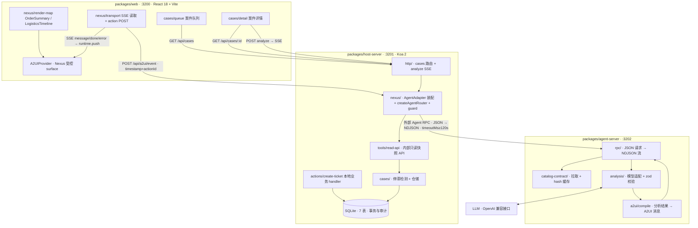
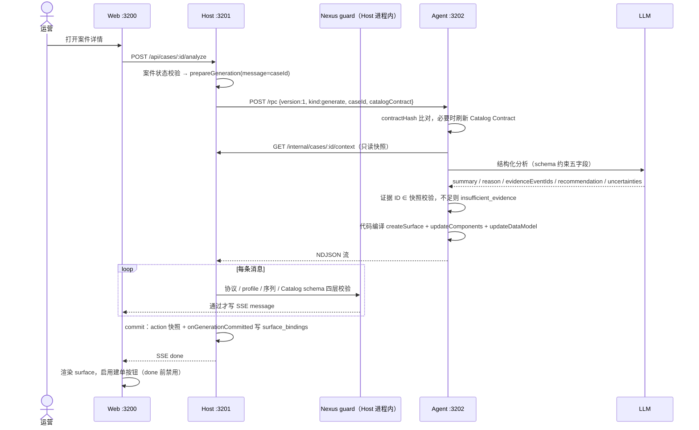
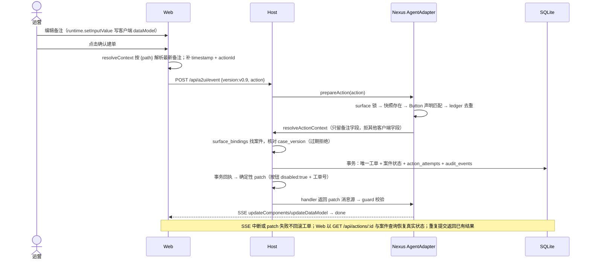
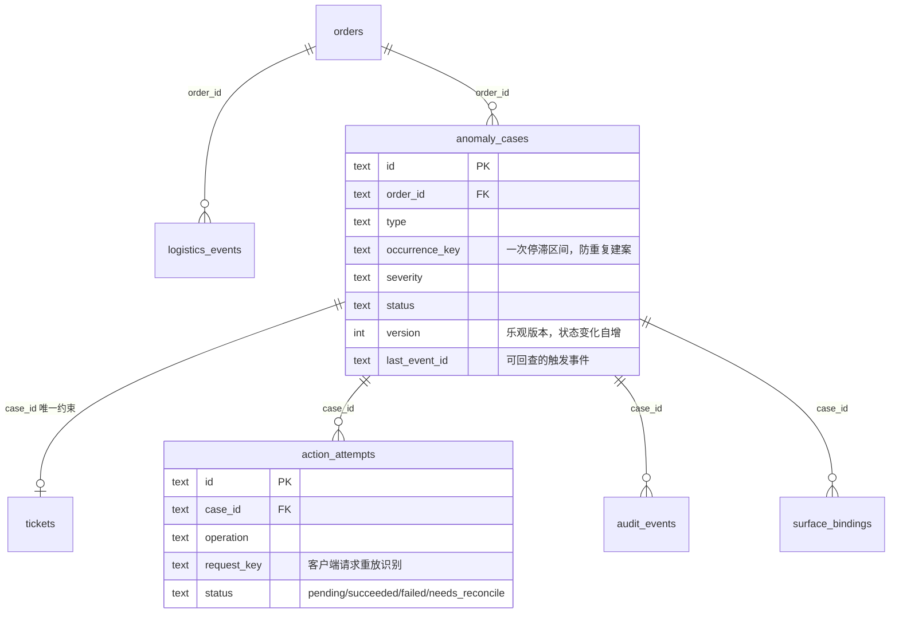
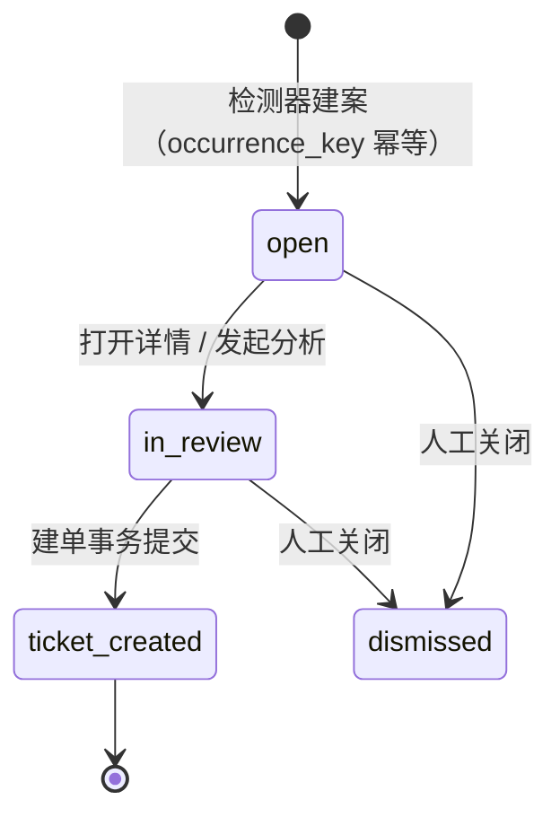

# OrderOps Copilot 框架设计图

配套文档：[架构设计与验收](architecture.md)（文字版设计，含第 10 节 Nexus 源码核查结论）、[实施顺序与任务清单](implementation-plan.md)。以下视图均基于 2026-09-28 对 `Nexus_UI` 0.1.0 源码核实后的接线方式绘制。

## 1. 系统拓扑与数据流



要点：

- 浏览器只与 Host 通信；Agent-server 无浏览器面，仅接受 Host 的 RPC，无 CORS。
- Nexus 三个包以 tarball 静态接入：`@nexus-ui/core` + `@nexus-ui/react` 进 Web，`@nexus-ui/server` 进 Host；guard 与 action 快照都运行在 Host 进程内。
- 业务事实的唯一权威是 Host 的 SQLite；A2UI dataModel 只是界面状态，不回传作为订单事实。

## 2. 包内模块结构

```text
packages/host-server/src/
├── main.ts                  # Koa 装配入口（挂路由、监听 3201）
├── config.ts                # env 读取 + 启动时 zod 校验
├── db/
│   ├── migrations/0001_init.sql
│   └── client.ts            # better-sqlite3 单例 + migration runner(user_version)
├── fixtures/                # 停滞物流案例 + 正常对照案例
├── cases/
│   ├── detect.ts            # 停滞检测规则（occurrence_key 幂等）
│   └── repository.ts        # 订单/物流/案件/工单/审计查询与事务
├── tools/
│   └── read-api.ts          # GET /internal/cases/:id/context（内部 token）
├── nexus/
│   ├── catalog.ts           # OrderOps Catalog v1 定义 + CatalogRegistry
│   ├── adapter.ts           # AgentAdapter 装配：生成源/context resolver/commit 钩子
│   └── create-ticket.ts     # 本地 action handler（版本校验 + 事务 + patch 编译）
└── http/
    ├── app.ts               # 挂 createAgentRouter + 自有 /api 路由
    └── cases.ts             # 队列/详情/analyze(SSE)/action 查询

packages/agent-server/src/
├── main.ts                  # Koa 入口（监听 3202，仅 /rpc + /health）
├── config.ts
├── rpc/
│   └── handler.ts           # 解析 Host 请求，返回 application/x-ndjson 流
├── catalog-contract/
│   └── client.ts            # GET Host catalog-contract，按 contractHash 缓存
├── tools/
│   └── case-context.ts      # GET Host /internal/cases/:id/context
├── analysis/
│   ├── schema.ts            # 分析结果 zod schema（summary/reason/evidence/…）
│   ├── model.ts             # OpenAI 兼容调用 + 结构化输出校验 + 重试
│   └── fixture.ts           # 确定性分析（回归测试与降级演示）
└── a2ui/
    └── compile.ts           # 校验后的分析 → createSurface/updateComponents/updateDataModel

packages/web/src/
├── main.tsx                 # Router + QueryProvider 装配
├── api/
│   └── client.ts            # fetch 封装（cases/analyze/actions）
├── cases/
│   ├── QueuePage.tsx        # 队列：筛选、搜索、导航
│   └── CaseDetailPage.tsx   # 详情：事实、时间线、分析、审核区
├── nexus/
│   ├── transport.tsx        # SSE → runtime.push；onAction → POST event
│   ├── render-map.tsx       # standardRenderMap 展开 + 两个业务组件
│   └── registry.ts          # 与 Host 共享的 CatalogDefinition 构造 CatalogRegistry
├── actions/
│   └── status.tsx           # done 前禁用、失败重试、断线恢复
└── contracts/               # re-export @orderops/contracts（仅类型与 schema）
```

跨包契约只有 `packages/contracts`（纯 zod schema + 类型，零运行时依赖）：`CaseSnapshot`、`ReadContextResponse`、`AnalysisResult`、`CreateTicketInput`。Agent 不 import Host 的数据库模块。

## 3. 生成时序（M2 主流程）



失败路径：任一消息校验失败或 commit 抛错 → 先回滚快照，再发 SSE `error` 事件；Web 显示错误与重试，不把半截流当可执行界面。

## 4. 建单 action 时序（M3 主流程）



## 5. 数据模型与状态机





操作状态：`pending → succeeded | failed | needs_reconcile`。领域幂等键 `caseId + operationType`（`tickets.case_id` 唯一约束兜底）；`request_key` 仅识别同一客户端请求重放，备注不参与幂等键。

## 6. 端口与环境变量

| 端口 | 服务            | 说明                                                   |
| ---- | --------------- | ------------------------------------------------------ |
| 3200 | Web（Vite dev） | `/api` 代理到 3201；SSE 经代理流式透传                 |
| 3201 | Host            | 生产模式下同时静态托管 `web/dist`，单一 origin 无 CORS |
| 3202 | Agent-server    | 仅 Host 可达                                           |

| 变量                                                    | 包           | 说明                                                    |
| ------------------------------------------------------- | ------------ | ------------------------------------------------------- |
| `PORT`                                                  | host / agent | 默认 3201 / 3202                                        |
| `ORDEROPS_DB_PATH`                                      | host         | SQLite 文件路径，默认 `var/orderops.sqlite`             |
| `ORDEROPS_SEED_FIXTURES`                                | host         | `1` 时启动写入 fixture 案件                             |
| `ORDEROPS_STALL_THRESHOLD_HOURS`                        | host         | 物流停滞阈值（severity 由此推导）                       |
| `ORDEROPS_AGENT_RPC_URL`                                | host         | 默认 `http://127.0.0.1:3202/rpc`                        |
| `ORDEROPS_AGENT_TIMEOUT_MS`                             | host         | 外部 RPC 超时，默认 `120000`（Nexus 默认 15s 必须覆盖） |
| `ORDEROPS_INTERNAL_TOKEN`                               | host / agent | `/internal/*` 共享鉴权，两边一致                        |
| `ORDEROPS_ANALYSIS_MODE`                                | agent        | `fixture`（默认，确定性）或 `model`                     |
| `OPENAI_API_KEY` / `OPENAI_BASE_URL` / `ORDEROPS_MODEL` | agent        | `model` 模式必填                                        |
